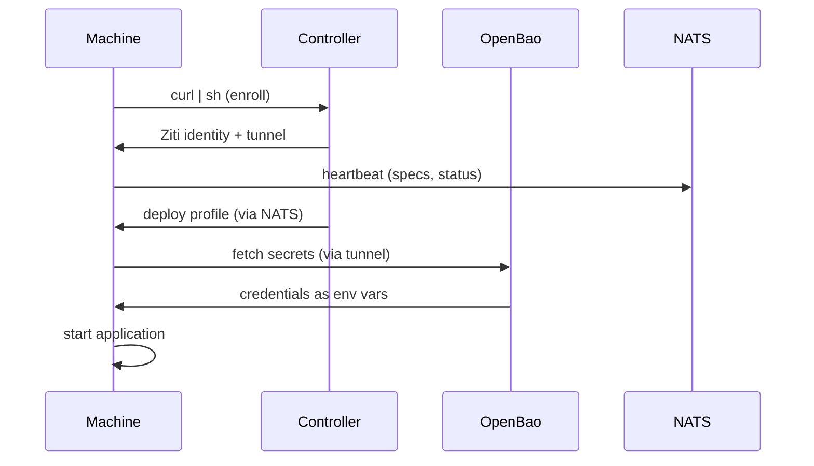
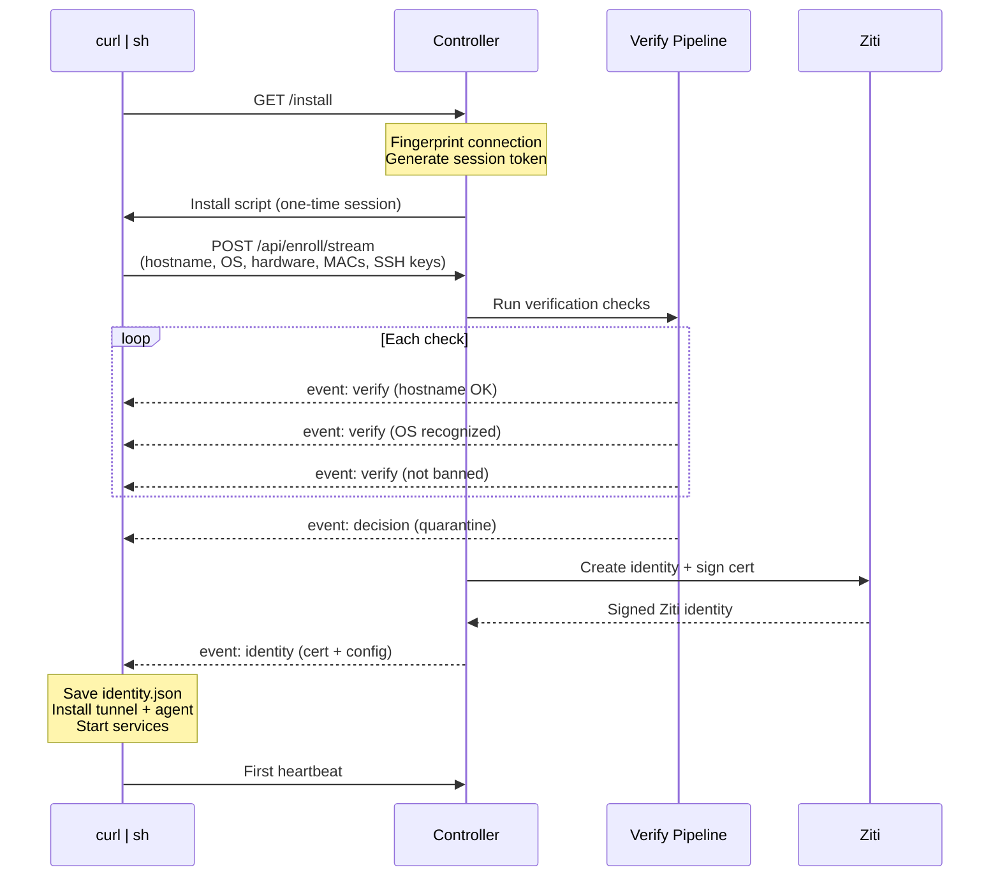
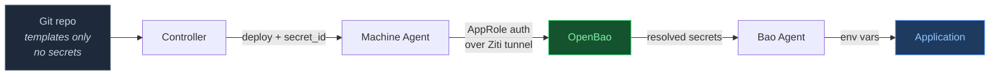

<h1 align="center">
  <br />
  TangoKore
  <br />
</h1>

<p align="center">
  <strong>The zero-trust mesh platform.</strong>
</p>

<p align="center">
  <a href="https://github.com/KontangoOSS/TangoKore/releases"></a>
  &nbsp;
  <a href="https://openziti.io"></a>
  &nbsp;
  <a href="https://openbao.org"></a>
  &nbsp;
  <a href="LICENSE"></a>
  &nbsp;
  
  &nbsp;
  <a href="https://github.com/KontangoOSS/TangoKore/stargazers"></a>
</p>

<p align="center">
  <a href="https://konoss.org">konoss.org</a> · <a href="https://github.com/KontangoOSS/TangoKore/releases">Releases</a> · <a href="docs/ARCHITECTURE.md">Architecture</a> · <a href="docs/PROFILES.md">Profiles</a> · <a href="supported.yaml">Platform Matrix</a>
</p>

<br />

<p align="center">
  <em>One command. Any machine. Fully encrypted, fully authenticated,<br />
  zero ports open, zero config files to write.</em>
</p>

<br />

---

### Contents

[What is TangoKore?](#what-is-tangokore) · [Quick Start](#-quick-start) · [Architecture](#architecture) · [Components](#components) · [How Enrollment Works](#how-enrollment-works) · [Modes](#modes) · [Deploy an App](#deploy-an-application) · [Secret Management](#secret-management) · [Platform Support](#platform-support) · [Privacy & Compliance](#privacy--compliance) · [FAQ](#faq) · [Contributing](#contributing)

---

<br />

## What is TangoKore?

You want to run software across machines — a home server, a cloud VM, a Raspberry Pi in a closet, a laptop at a coffee shop — and you want them all to talk to each other securely, discover services automatically, and deploy applications without touching a config file.

TangoKore is the SDK that makes this happen. One command puts a machine on your encrypted mesh network. From there, the controller takes over — pushing configurations, injecting secrets, starting containers, routing traffic. Every machine is authenticated by identity, not by IP address. Every connection is end-to-end encrypted. Every port is closed to the outside world.

It's built on [OpenZiti](https://openziti.io) for the overlay network, [OpenBao](https://openbao.org) for secrets, and [Schmutz](https://github.com/KontangoOSS/schmutz) for edge security. TangoKore ties them together into something you can use with one command.

<br />

> Think of it like this: Kubernetes orchestrates containers on a cluster.
> TangoKore orchestrates machines across the internet.
>
> Except there's no cluster. No VPN. No firewall rules.
> Just a mesh — and every machine on it is invisible to everyone else.

<br />

## Quick Start

### Install (one command)

```sh
curl -fsSL https://ctrl.konoss.org/install | sudo sh
```

That's it. Your machine is now on the mesh.

### What just happened?

1. The installer collected your machine's fingerprint (hardware, OS, network)
2. It enrolled the machine with the controller via an encrypted stream
3. It installed a tunnel, an agent, a reverse proxy, and a secrets engine
4. Your machine is now heartbeating, discoverable, and waiting for instructions

### Choose a mode

```sh
# User-facing machine — runs a web portal, you sign in to claim it
curl -fsSL https://ctrl.konoss.org/install | sudo sh -s -- --mode=portal

# Headless worker — no UI, claimed by the controller via a deploy command
curl -fsSL https://ctrl.konoss.org/install | sudo sh -s -- --mode=service
```

### Check status

```sh
kontango status
```

```
kontango v1.0.0
  node:     eager-phoenix
  mode:     service
  host:     web-prod-1 (linux/amd64)
  services:
    [OK] kontango-tunnel
    [OK] kontango-agent
    [  ] kontango-portal
    [OK] kontango-caddy
    [  ] kontango-bao-agent
```

<br />

## Architecture

TangoKore is a platform, not a single application. It's made of components that each do one thing well, composed through the mesh.

```mermaid
flowchart TB
    subgraph machine["Every Machine"]
        kontango["kontango SDK<br/><em>enroll + agent + portal</em>"]
        tunnel["ziti tunnel<br/><em>overlay connectivity</em>"]
        caddy["caddy<br/><em>reverse proxy</em>"]
        bao_agent["bao agent<br/><em>secret injection</em>"]
        app["your app<br/><em>docker / binary / anything</em>"]

        kontango --> tunnel
        kontango --> caddy
        bao_agent --> app
    end

    subgraph controller["Controller Nodes"]
        ctrl["kontango-controller<br/><em>enrollment + deploy API</em>"]
        nats["NATS + JetStream<br/><em>telemetry bus</em>"]
        bao["OpenBao<br/><em>secrets vault</em>"]
        ziti_ctrl["Ziti Controller<br/><em>overlay control plane</em>"]
        schmutz["schmutz<br/><em>edge gateway</em>"]
    end

    tunnel <-->|"E2EE overlay"| ziti_ctrl
    kontango -->|"telemetry"| nats
    kontango <--|"config push"| ctrl
    bao_agent -->|"secrets"| bao
    schmutz -->|"TLS classification"| tunnel

    style machine fill:#0f172a,stroke:#334155,color:#e2e8f0
    style controller fill:#0f172a,stroke:#334155,color:#e2e8f0
    style kontango fill:#1e3a5f,stroke:#3b82f6,color:#93c5fd
    style ctrl fill:#1e3a5f,stroke:#3b82f6,color:#93c5fd
    style schmutz fill:#431407,stroke:#f97316,color:#fdba74
```

### The Mesh

Every connection between machines travels through the [OpenZiti](https://openziti.io) overlay network. There are no open ports. No VPN tunnels. No firewall rules to maintain. The network is identity-based — machines authenticate with mTLS certificates, not IP addresses. If a machine isn't enrolled, the network doesn't exist to it.

### The Flow



For a deeper dive, see [Architecture](docs/ARCHITECTURE.md).

<br />

## Components

TangoKore is built from independent, versioned components. Each one has its own repo, its own release cycle, and its own documentation. TangoKore ties them together.

### Core (this repo)

| Command | What it does |
|---------|-------------|
| `kontango enroll` | Joins a machine to the mesh. Interactive TUI or non-interactive. |
| `kontango agent` | Background daemon. Sends telemetry, receives config, applies profiles. |
| `kontango portal` | Local web UI. Shows docs by default, machine dashboard when authenticated. |
| `kontango status` | Shows node info, mode, services, and claim status. |

### Infrastructure

| Component | Repo | Role |
|-----------|------|------|
| [**Schmutz**](https://github.com/KontangoOSS/schmutz) | `KontangoOSS/schmutz` | L4 edge gateway. TLS fingerprinting, JA4 classification, self-healing. |
| **Kontango Controller** | `KontangoOSS/kontango-controller` | Enrollment, deploy pipeline, embedded NATS + JetStream, config push. |
| [**OpenZiti**](https://openziti.io) | `openziti/ziti` | Zero-trust overlay. mTLS, identity-based routing, zero open ports. |
| [**OpenBao**](https://openbao.org) | `openbao/openbao` | Secrets. AppRole auth, KV store, dynamic credentials, template rendering. |
| [**Caddy**](https://caddyserver.com) | `caddyserver/caddy` | Reverse proxy. Automatic HTTPS, extended with Ziti transport. |
| [**NATS**](https://nats.io) | `nats-io/nats-server` | Message bus. JetStream for telemetry persistence. |

### Applications

Applications are deployed as **profiles** — a config bundle containing a `bao-agent.hcl`, a `compose.yml`, and templates. The controller pushes profiles to machines via NATS.

Browse the full catalog at **[konoss.org](https://konoss.org)**.

<br />

## How Enrollment Works

Enrollment is the moment a machine becomes part of the mesh. It starts as an anonymous device and ends as a verified, heartbeating node.



### What the installer collects

The machine sends a fingerprint to the controller — enough to identify it and check for known threats, not enough to be invasive:

- **OS**: hostname, distribution, version, architecture, kernel
- **Hardware**: CPU model, core count, memory, machine-id, serial number, disk serials
- **Network**: MAC addresses, interfaces, DNS servers, default gateway
- **System**: uptime, SSH host public keys, open ports, installed package count

The controller runs this through a verification pipeline: hostname check, OS catalog lookup, ban list check, fingerprint matching for returning devices. New machines land in **quarantine** — on the mesh but with minimal privileges until claimed.

<br />

## Modes

### Portal Mode

For machines that face users. A laptop, a workstation, a kiosk.

```sh
curl -fsSL https://ctrl.konoss.org/install | sudo sh -s -- --mode=portal
```

- Runs the web portal on the mesh (`<nickname>.tango`)
- Shows docs and quickstart by default
- Sign in with your identity provider (OIDC)
- Signing in **claims** the machine — binds it to your account
- Becomes your personal gateway to all your authorized services

### Service Mode

For machines that run workloads. A server, a VM, a container host.

```sh
curl -fsSL https://ctrl.konoss.org/install | sudo sh -s -- --mode=service
```

- No web UI (portal installed but inactive)
- Heartbeats its specs to the controller
- Sits in an unclaimed pool until the controller assigns it a profile
- The assignment is the **claim** — delivered as a NATS message

Both modes start in quarantine with minimal mesh privileges. The claim is what gives a machine purpose.

<br />

## Deploy an Application

Machines start blank. To run something, the controller pushes a **profile**:

```sh
curl -X POST https://controller.tango/api/deploy \
  -d '{
    "profile": "ticketarr-dev",
    "version": "v2.1.0",
    "target": "eager-phoenix",
    "bao_role": "ticketarr-dev"
  }'
```

### What happens on the machine

1. Agent receives the deploy instruction via NATS
2. Pulls the profile archive from git (over the mesh)
3. Writes the Bao agent config + one-time AppRole credentials
4. Bao agent starts, authenticates to OpenBao over the tunnel
5. Secrets are resolved and injected as environment variables
6. Docker Compose starts the application
7. Agent reports success via telemetry

No secrets in git. No secrets on disk. When a secret rotates in OpenBao, the Bao agent detects the change, re-renders, and restarts the container automatically.

See [Profiles](docs/PROFILES.md) for how to create your own.

<br />

## Secret Management

Secrets flow through OpenBao, never through git or config files.



**For applications**: OpenBao agent renders secrets into environment variables. Your app reads `os.Getenv("DATABASE_URL")`. No SDK needed, no code changes.

**For users**: Authenticate via your identity provider (OIDC). External providers like Google, GitHub, SAML, and passkeys are supported. Bao trusts the JWTs and maps claims to policies.

**For containers**: The Bao agent runs on the host and injects secrets into the container environment. The container never talks to Bao directly.

<br />

## What Gets Installed

```
/opt/kontango/
  bin/
    kontango          24 MB   SDK (agent + portal + enrollment)
    ziti             151 MB   Tunnel daemon
    caddy             60 MB   Reverse proxy
    bao               69 MB   Secret injection agent
  identity.json                Ziti identity (mTLS cert + key)
  machine.json                 Enrollment record
  Caddyfile                    Proxy config (managed by profiles)
  profiles/                    Deployed profiles
```

| Service | Always Running | Purpose |
|---------|---------------|---------|
| `kontango-tunnel` | Yes | Overlay connectivity |
| `kontango-agent` | Yes | Telemetry + config listener |
| `kontango-portal` | Portal mode only | Web UI |
| `kontango-caddy` | Yes | Reverse proxy |
| `kontango-bao-agent` | After first deploy | Secret injection |

<br />

## Platform Support

TangoKore runs anywhere Go compiles and a service manager runs.

| | Supported |
|---|---|
| **Linux** | Ubuntu 24.04 / 22.04, Debian 12 / 13, Proxmox VE 8 / 9, Alpine 3.20, Rocky Linux 9, Fedora 40, Arch Linux, Raspberry Pi OS |
| **macOS** | 15 / 14 / 13 (Intel and Apple Silicon) |
| **Windows** | 11 / 10, Server 2022 / 2019 |
| **Containers** | Docker, Podman, LXC |

See [`supported.yaml`](supported.yaml) for the full matrix.

<br />

## Version Compatibility

Each TangoKore release pins compatible versions of all components:

| TangoKore | Ziti | OpenBao | Caddy | Schmutz |
|-----------|------|---------|-------|---------|
| v1.0.0 | v2.0.0-pre5 | v2.5.2 | v2.11.1 | v1.0.0 |

<br />

## FAQ

<details>
<summary><strong>How is this different from a VPN?</strong></summary>
<br />
A VPN gives you a network. TangoKore gives you a platform. The network is just the transport layer — on top of it you get enrollment, identity, secret management, config deployment, telemetry, and application orchestration. Also, VPNs open ports. TangoKore doesn't.
</details>

<details>
<summary><strong>How is this different from Kubernetes?</strong></summary>
<br />
Kubernetes assumes a cluster — co-located machines, shared storage, a control plane. TangoKore assumes the opposite — machines scattered across the internet, no shared infrastructure, connected only by the mesh. Think of it as orchestration for the long tail of machines that don't fit in a cluster.
</details>

<details>
<summary><strong>Do my applications need to know about TangoKore?</strong></summary>
<br />
No. Applications read environment variables or config files. The Bao agent handles secret injection. Caddy handles routing. The tunnel handles connectivity. Your app just runs.
</details>

<details>
<summary><strong>What if a machine loses connectivity?</strong></summary>
<br />
The agent buffers telemetry locally for 5 minutes and replays it on reconnect. The application keeps running — secrets are already in memory. The machine falls back to HTTP heartbeating if the tunnel drops.
</details>

<details>
<summary><strong>Is this production-ready?</strong></summary>
<br />
The underlying technologies (OpenZiti, OpenBao, Caddy, NATS) are production-grade. The enrollment flow, agent, and deploy pipeline are functional and tested. TangoKore has reached its v1.0 release.
</details>

<details>
<summary><strong>Can I use just part of it?</strong></summary>
<br />
Yes. The components are independent. You can use OpenZiti without TangoKore. You can use Schmutz without enrollment. You can use the Bao agent without the rest. TangoKore is the glue, not a cage.
</details>

<br />

## Privacy & Compliance

**Your data, your control. Zero required user input.**

TangoKore requires only **three things minimum** to work (like the Miranda Rights inform you of fundamental rights):

1. **Operating System** — so we know what to install
2. **CPU Architecture** — so we know which binary to use
3. **Machine Identifier** — so we recognize this machine (auto-issued if you don't provide one)

Everything else is optional. You have complete control over where data goes:

### Public Enrollment
Use Kontango's public controller (`ctrl.konoss.org`):
- Fingerprints securely transmitted (TLS 1.3)
- Processed by Kontango infrastructure
- GDPR & CCPA compliant
- Data deletion available anytime
- See [PRIVACY.md](PRIVACY.md) for details

### Private Controller
Run your own Kontango controller:
- Fingerprints never leave your infrastructure
- Completely private and under your control
- Air-gap from public internet
- Full compliance responsibility (you decide retention, access, encryption)
- Self-hosting guide: [docs.konoss.org/self-hosted](https://docs.konoss.org/self-hosted)

### Before Enrollment
Users see a clear disclosure:
```
MACHINE FINGERPRINTING DISCLOSURE
This machine will send hardware information to identify itself:
  • Hostname, OS version, kernel, architecture
  • CPU model/cores, system memory, motherboard ID
  • Network interface MAC addresses

Why: Allows returning machines to be recognized and restore their
previous permissions. This is public hardware info only.
```

Interactive users can review collected data and abort (`n` key) before confirming.

### Legal & Transparency
- **[MIRANDA_RIGHTS.md](MIRANDA_RIGHTS.md)** — What's required (minimum) vs. optional in the SDK
- **[ULA.md](ULA.md)** — Universal License Agreement with full data handling terms
- **[PRIVACY.md](PRIVACY.md)** — Privacy controls and compliance checklists
- **konoss.org/privacy** — Public privacy policy (for public enrollment)

### Data Subject Rights
If using public enrollment, you have:
- **Right to Access:** What fingerprints Kontango stores about your machines
- **Right to Delete:** Request deletion anytime (contact privacy@konoss.org)
- **Right to Portability:** Export your machine identity certificate
- **Right to Correction:** Update identifiers

Contact: **privacy@konoss.org**

<br />

## Contributing

TangoKore follows the [Templatarr](https://github.com/KontangoOSS/templatarr) project standard for structure and CI/CD.

```sh
# Build the SDK
make build

# Run tests
make test

# Cross-compile for all platforms
make build-all
```

<br />

## License

[MIT](LICENSE)

<br />

## Star History

<a href="https://star-history.com/#KontangoOSS/TangoKore&Date">
 <picture>
   <source media="(prefers-color-scheme: dark)" srcset="https://api.star-history.com/svg?repos=KontangoOSS/TangoKore&type=Date&theme=dark" />
   <source media="(prefers-color-scheme: light)" srcset="https://api.star-history.com/svg?repos=KontangoOSS/TangoKore&type=Date" />
   
 </picture>
</a>

<br />

---

<p align="center">
  <a href="https://konoss.org"><strong>konoss.org</strong></a>
</p>

<p align="center">
  <em>Every machine. One command. Zero trust.</em>
</p>
